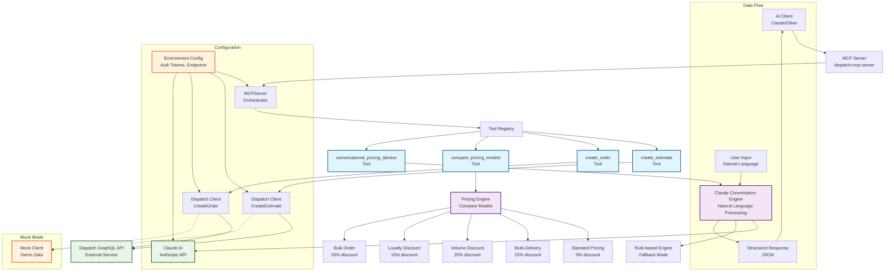

# MCP Tool Architecture Diagram

## Architecture Overview

### Core Components

1. **MCP Server** - Central orchestrator that receives requests from AI clients
2. **Tool Registry** - Manages available tools and their implementations
3. **Dispatch Client** - Handles communication with external Dispatch GraphQL API
4. **Pricing Engine** - Calculates and compares different pricing models
5. **Claude Conversation Engine** - Provides natural language processing capabilities

### Available Tools

1. **create_estimate** - Creates cost estimates for delivery orders
2. **create_order** - Creates actual delivery orders
3. **compare_pricing_models** - Compares different pricing strategies
4. **conversational_pricing_advisor** - Provides AI-powered pricing advice

### Pricing Models

- **Standard**: 0% discount (baseline)
- **Multi-Delivery**: 15% discount for 2+ deliveries
- **Volume**: 20% discount for 5+ deliveries + 3+ orders/month
- **Loyalty**: 10% discount for gold tier customers
- **Bulk Order**: 25% discount for 10+ deliveries

### Key Features

- **Fallback Mode**: Rule-based processing when Claude is unavailable
- **Mock Mode**: Demo functionality without external API dependencies
- **Context Management**: Maintains conversation state and customer profiles
- **Flexible Authentication**: Supports both token-based and IDP authentication
